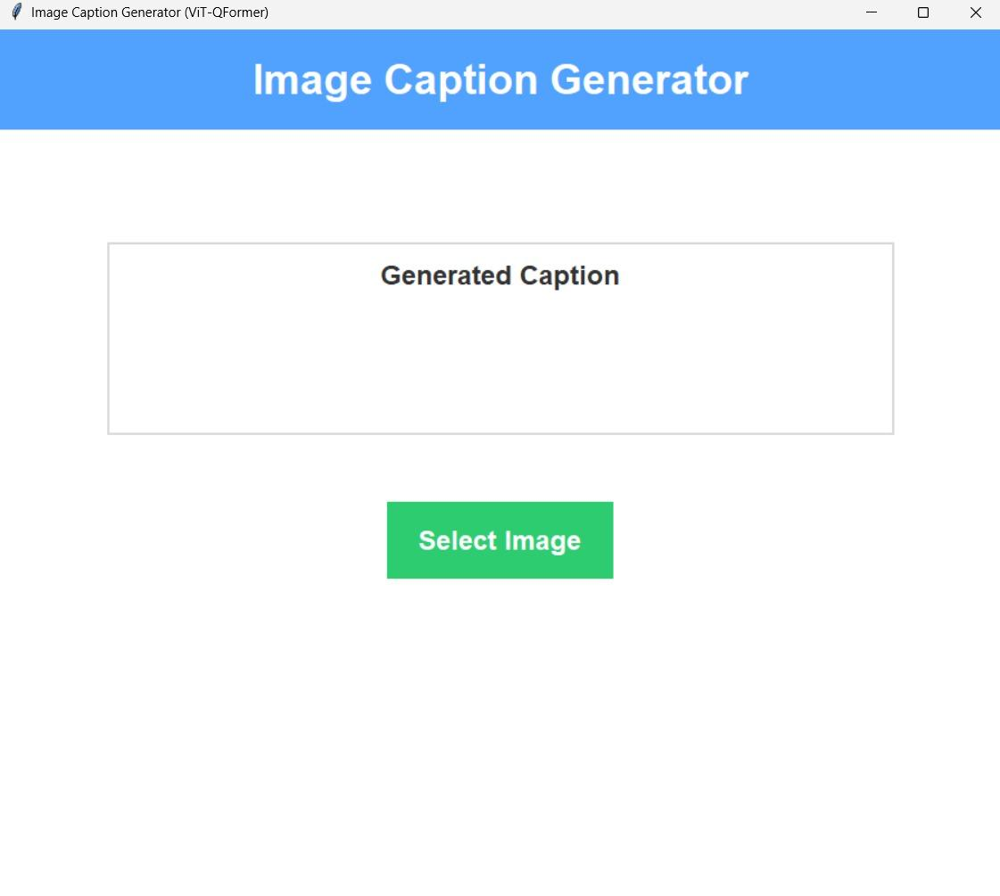
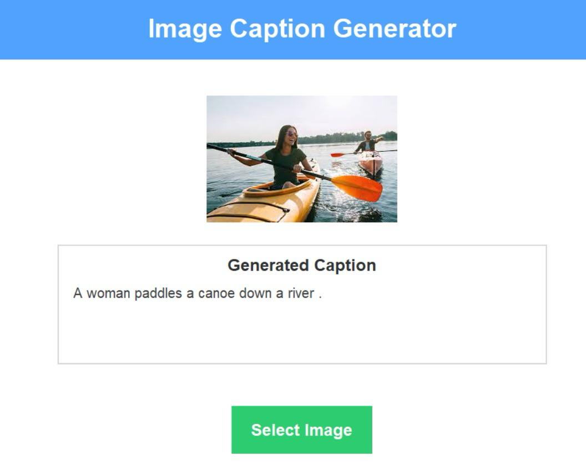

# Image Caption Generator using ViT + Q-Former + Flan-T5

## Overview

This project is a deep learning-based **Image Caption Generator** that automatically generates natural language descriptions for input images.

The architecture combines:

* **Vision Transformer (ViT)** as the image encoder
* **Q-Former** for visual-language bridging
* **Flan-T5 Base** as the language decoder

The model was trained on the **Flickr30k dataset** and can generate meaningful captions for unseen images.

---
## Application Screenshots

### GUI Interface



### Sample Caption Generation



---

## Dataset

**Flickr30k**

* 31,000+ images
* 5 captions per image
* Human-annotated captions
* Widely used benchmark for image captioning

---

## Model Architecture

```text
Input Image
     │
     ▼
Vision Transformer (ViT)
     │
     ▼
Q-Former
     │
     ▼
Flan-T5 Decoder
     │
     ▼
Generated Caption
```

### Components

#### Vision Encoder

* Google ViT Base Patch16-224
* Frozen during training

#### Q-Former

* Learnable Query Tokens
* Multi-Head Cross Attention
* Feed Forward Network

#### Language Decoder

* Google Flan-T5 Base
* Last decoder layers fine-tuned

---

## Features

✅ Upload image through Tkinter GUI

✅ Generate captions automatically

✅ Transformer-based architecture

✅ Supports JPG, JPEG, PNG and WEBP images

✅ GPU acceleration using CUDA

---

## Project Structure

```text
Image-Caption-Generator/
│
├── app_vit47.py
├── model_vit47.py
├── requirements.txt
├── README.md
└── epoch_vit_4.pth
```

---

## Installation

### 1. Clone Repository

```bash
git clone https://github.com/Abdulkareem-01/Image-Caption-Generator.git
cd Image-Caption-Generator
```

### 2. Install Dependencies

```bash
pip install -r requirements.txt
```

---

## Model Weights

The trained model file (~1.47 GB) is not included in the repository.

Download:

**epoch_vit_4.pth**

from the Google Drive link below:

**Google Drive Link:**
https://drive.google.com/file/d/1DOJPRfecEXrg3zt_VUvsF_-gyLL2oyXn/view?usp=drive_link

Place the downloaded file inside the project directory:

```text
Image-Caption-Generator/
│
├── app_vit47.py
├── model_vit47.py
└── epoch_vit_4.pth
```

---

## Run the Application

```bash
python app_vit47.py
```

---

## Supported Image Formats

* JPG
* JPEG
* PNG
* WEBP

---

## Technologies Used

* Python
* PyTorch
* Transformers
* Vision Transformer (ViT)
* Flan-T5
* Pillow
* Tkinter

---

## Future Improvements

* Web-based interface using Flask/Gradio
* BLEU, ROUGE and CIDEr evaluation
* Hugging Face deployment
* Larger Vision Transformer models

---

## Author

**Shaik Abdul Kareem**

---

## License

This project is intended for educational and research purposes.
